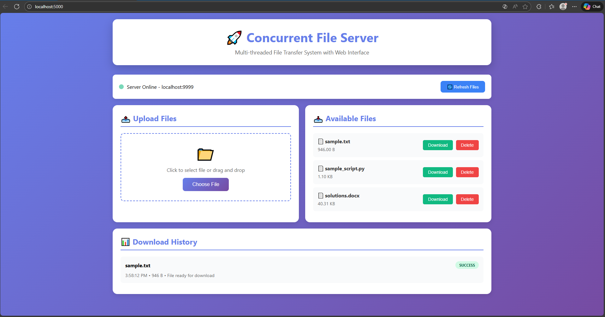

# 🚀 Concurrent File Server with Multi-Threading & Web Interface

<div align="center">



**A professional multi-threaded TCP file server with a modern Flask web interface**

[](https://www.python.org/downloads/)
[](https://flask.palletsprojects.com/)
[](LICENSE)
[](https://github.com/deba75/Concurrent-File-Server-with-Multi-Threading-Web-Interface)

[Features](#-features) • [Demo](#-demo) • [Installation](#-installation) • [Usage](#-usage) • [Architecture](#-architecture) • [Contributing](#-contributing)

</div>

---

## 📋 Overview

A **production-ready concurrent file server** that demonstrates true multi-threaded architecture using Python. Each client connection spawns a dedicated server thread, enabling **simultaneous file transfers** without blocking. Perfect for learning concurrent programming, socket communication, and building distributed systems.

### 🎯 What Makes This Special?

- **True Concurrency**: Thread-per-client architecture for real parallel file transfers
- **Educational**: Learn socket programming, threading, and web development
- **Production Ready**: Error handling, logging, and robust architecture
- **Cross-Platform**: Works seamlessly on Windows, macOS, and Linux
- **Modern UI**: Beautiful, responsive web interface with real-time updates

---

## ✨ Features

### 🔄 Server-Side
- **Multi-threaded TCP Server**: Spawns dedicated thread for each client
- **Concurrent Handling**: Multiple simultaneous file transfers
- **Chunked Streaming**: 1000-byte chunks with 200ms delays for controlled transfer
- **Connection-Oriented**: Reliable TCP socket communication
- **Thread-Safe Operations**: Proper resource management and cleanup

### 🌐 Web Interface
- **Modern UI**: Beautiful gradient design with responsive layout
- **Drag & Drop Upload**: Easy file upload to server
- **One-Click Download**: Files download directly to your PC's Downloads folder
- **Real-Time Status**: Live server monitoring (online/offline indicator)
- **Download History**: Track all file transfer operations
- **File Management**: Upload, download, list, and delete files

### 💻 Technical Features
- **Socket Programming**: Low-level TCP/IP communication
- **Threading Model**: One thread per connection for true parallelism
- **Rate Limiting**: Controlled transfer with sleep intervals
- **Error Handling**: Graceful failure recovery and user feedback
- **Cross-Platform**: Python-based, works on all major OS

---

## 📸 Demo

### Web Interface in Action


**Features Shown:**
- ✅ Server Online Status (Green indicator)
- ✅ Upload Files Section (Drag & drop support)
- ✅ Available Files List (3 files ready to download)
- ✅ Download History (Successful transfer shown)
- ✅ Clean, Modern UI

### Server Console Output

```
[SERVER] File Server started on localhost:9999
[SERVER] Serving files from: server_files/
[SERVER] Waiting for client connections...

[SERVER] New connection from ('127.0.0.1', 52341)
[SERVER] Spawned ClientThread-1 for file: sample.txt
[THREAD ClientThread-1] Starting file transfer (946 bytes)
[THREAD ClientThread-1] Sent 946 bytes
[THREAD ClientThread-1] File transfer completed ✓

[SERVER] New connection from ('127.0.0.1', 52342)
[SERVER] Spawned ClientThread-2 for file: sample_script.py
[THREAD ClientThread-2] Starting file transfer (1.10 KB)
```

---

## 🏗️ Architecture

### System Design

```
┌─────────────────────────────────────────────────────────┐
│                    USER'S BROWSER                        │
│              http://localhost:5000                       │
└────────────────────┬────────────────────────────────────┘
                     │ HTTP Requests
                     ↓
┌─────────────────────────────────────────────────────────┐
│              WEB INTERFACE (Flask)                       │
│                  Port: 5000                              │
│  ┌──────────┐  ┌──────────┐  ┌──────────┐             │
│  │ Upload   │  │ Download │  │ Delete   │              │
│  │ Handler  │  │ Handler  │  │ Handler  │              │
│  └────┬─────┘  └─────┬────┘  └────┬─────┘             │
└───────┼──────────────┼────────────┼────────────────────┘
        │              │            │
        ↓              ↓            ↓
┌─────────────────────────────────────────────────────────┐
│           FILE SERVER (Multi-threaded)                   │
│                Port: 9999                                │
│                                                          │
│  Main Thread: Accepts connections                        │
│      ↓                                                   │
│  ┌──────────────┐  ┌──────────────┐  ┌──────────────┐ │
│  │ ClientThread │  │ ClientThread │  │ ClientThread │  │
│  │     #1       │  │     #2       │  │     #3       │  │
│  │  file1.txt   │  │  file2.py    │  │  file3.docx  │  │
│  │              │  │              │  │              │  │
│  │ Read 1000B   │  │ Read 1000B   │  │ Read 1000B   │  │
│  │ Sleep 200ms  │  │ Sleep 200ms  │  │ Sleep 200ms  │  │
│  │ Repeat...    │  │ Repeat...    │  │ Repeat...    │  │
│  └──────────────┘  └──────────────┘  └──────────────┘ │
└─────────────────────────────────────────────────────────┘
```

### Thread-per-Client Model

```
Client Request → Main Server → Spawn Thread → Transfer File
                      ↓
                More Clients → More Threads → Concurrent Transfers
```

---

## 📦 Project Structure

```
Concurrent-File-Server/
├── file_server.py          # Multi-threaded TCP server
├── file_client.py          # Client module for downloads
├── web_interface.py        # Flask web application
├── config.py               # Configuration settings
├── requirements.txt        # Python dependencies
├── README.md              # This file
├── screenshot.png         # Web interface screenshot
│
├── Startup Scripts (Windows)
├── start_all.bat          # Start both servers
├── start_server.bat       # Start file server only
├── start_web.bat          # Start web interface only
│
├── Startup Scripts (macOS/Linux)
├── start_all.sh           # Start both servers
├── start_server.sh        # Start file server only
├── start_web.sh           # Start web interface only
│
├── Documentation
├── QUICKSTART.txt         # Quick start guide
├── MAC_SETUP.md          # macOS specific instructions
│
├── templates/
│   └── index.html         # Web UI interface
│
├── server_files/          # Files available for download
│   ├── sample.txt
│   ├── sample_script.py
│   └── solutions.docx
│
└── downloads/             # Temporary download cache
```

---

## 🚀 Installation

### Prerequisites

- **Python 3.7+** (Check: `python --version` or `python3 --version`)
- **pip** (Python package manager)

### Quick Setup

#### 1. Clone the Repository

```bash
git clone https://github.com/deba75/Concurrent-File-Server-with-Multi-Threading-Web-Interface.git
cd Concurrent-File-Server-with-Multi-Threading-Web-Interface
```

#### 2. Install Dependencies

**Windows:**
```bash
pip install -r requirements.txt
```

**macOS/Linux:**
```bash
pip3 install -r requirements.txt
```

#### 3. Make Scripts Executable (macOS/Linux only)

```bash
chmod +x *.sh
```

---

## 🎮 Usage

### Method 1: One-Click Start (Easiest!)

#### Windows:
```bash
start_all.bat
```

#### macOS/Linux:
```bash
./start_all.sh
```

Then open: **http://localhost:5000**

---

### Method 2: Manual Start (Better Control)

#### Windows:

**Terminal 1 - File Server:**
```bash
python file_server.py
```

**Terminal 2 - Web Interface:**
```bash
python web_interface.py
```

#### macOS/Linux:

**Terminal 1 - File Server:**
```bash
python3 file_server.py
```

**Terminal 2 - Web Interface:**
```bash
python3 web_interface.py
```

Then open: **http://localhost:5000**

---

### Method 3: Command-Line Client

For direct file downloads without the web interface:

**Windows:**
```bash
python file_client.py
```

**macOS/Linux:**
```bash
python3 file_client.py
```

Enter the filename when prompted.

---

## 📖 How to Use the Web Interface

### 1. Upload Files
- Click "Choose File" button or drag & drop files
- Files are saved to `server_files/` directory
- Instantly available for download

### 2. Download Files
- Click the green "Download" button next to any file
- File downloads to your PC's Downloads folder
- Progress shown in Download History

### 3. Delete Files
- Click the red "Delete" button
- Confirm deletion
- File removed from server

### 4. Monitor Server Status
- **Green dot** = Server online and ready
- **Red dot** = Server offline
- Status updates every 5 seconds

---

## 🧪 Test Concurrent Downloads

**Demonstration of True Multi-Threading:**

1. Open **3 browser tabs** to http://localhost:5000
2. Download **different files** in each tab **simultaneously**
3. Watch the **server console** - you'll see multiple threads working!

**Example Output:**
```
[SERVER] Spawned ClientThread-1 for file: sample.txt
[SERVER] Spawned ClientThread-2 for file: sample_script.py
[SERVER] Spawned ClientThread-3 for file: solutions.docx
[THREAD ClientThread-1] Sent 1000 bytes (1000/946)
[THREAD ClientThread-2] Sent 1000 bytes (1000/1.10 KB)
[THREAD ClientThread-3] Sent 1000 bytes (1000/40.31 KB)
```

**This proves TRUE CONCURRENCY** - multiple downloads happening in parallel! 🎉

---

## ⚙️ Configuration

Edit `config.py` to customize:

```python
# Server Configuration
SERVER_HOST = 'localhost'    # Server IP address
SERVER_PORT = 9999           # Server port
BUFFER_SIZE = 1000           # Bytes per chunk (flush size)
SLEEP_TIME = 0.2             # Seconds between chunks (200ms)

# Web Server Configuration
WEB_HOST = 'localhost'       # Web interface IP
WEB_PORT = 5000              # Web interface port

# File Storage
FILES_DIRECTORY = 'server_files'  # Server file directory
```

---

## 🛑 Stopping Servers

Press **Ctrl+C** in the terminal(s) running the servers.

**Or kill processes by port:**

**Windows:**
```bash
netstat -ano | findstr :9999
taskkill /PID <PID> /F
```

**macOS/Linux:**
```bash
lsof -ti:9999 | xargs kill -9
lsof -ti:5000 | xargs kill -9
```

---

## 🎓 Learning Outcomes

This project teaches:

- ✅ **Socket Programming**: Low-level TCP/IP communication
- ✅ **Multi-Threading**: Concurrent execution and thread management
- ✅ **Client-Server Architecture**: Distributed system design
- ✅ **File I/O Operations**: Reading and writing files
- ✅ **Web Development**: Flask framework and REST APIs
- ✅ **Thread Safety**: Race conditions and synchronization
- ✅ **Network Protocols**: Data streaming and chunked transfer
- ✅ **Error Handling**: Graceful failure recovery

---

## 🔍 Key Technical Concepts

### 1. Multi-Threading
- **Thread-per-Client Model**: Each connection gets dedicated thread
- **Concurrent Execution**: Multiple threads run in parallel
- **Independent Lifecycle**: Each thread manages its own resources

### 2. Socket Programming
- **TCP Sockets**: Connection-oriented, reliable transfer
- **Client-Server Model**: Request-response pattern
- **Port Binding**: Server listens on specific port

### 3. Chunked Transfer
- **1000-byte chunks**: Controlled data flow
- **200ms delays**: Simulates network latency
- **Progress Tracking**: Monitor transfer completion

### 4. Web Interface
- **Flask Framework**: Python web server
- **REST API**: HTTP endpoints for operations
- **AJAX Requests**: Asynchronous communication

---

## 🛠️ Troubleshooting

### Server shows "Offline"
**Solution:** Start the file server first
```bash
python file_server.py    # Windows
python3 file_server.py   # macOS/Linux
```

### "Address already in use"
**Solution:** Port is already occupied
```bash
# Kill the process using the port
lsof -ti:9999 | xargs kill -9    # macOS/Linux
netstat -ano | findstr :9999     # Windows (then taskkill)
```

### "No module named 'flask'"
**Solution:** Dependencies not installed
```bash
pip install -r requirements.txt
```

### Downloads not working
**Solution:** Refresh your browser (Ctrl+F5 or Cmd+Shift+R)

---

## 🤝 Contributing

Contributions are welcome! Here's how:

1. **Fork** the repository
2. **Create** a feature branch (`git checkout -b feature/AmazingFeature`)
3. **Commit** your changes (`git commit -m 'Add AmazingFeature'`)
4. **Push** to the branch (`git push origin feature/AmazingFeature`)
5. **Open** a Pull Request

### Ideas for Contributions:
- Add authentication system
- Implement SSL/TLS encryption
- Add file compression
- Create progress bars
- Add file preview
- Implement search functionality

---

## 📝 License

This project is licensed under the **MIT License** - see the [LICENSE](LICENSE) file for details.

---

## 🌟 Show Your Support

If this project helped you learn concurrent programming or socket communication:
- ⭐ **Star** this repository
- 🍴 **Fork** it for your own projects
- 📢 **Share** it with others

---

## 📞 Contact & Support

- **GitHub**: [@deba75](https://github.com/deba75)
- **Repository**: [Concurrent File Server](https://github.com/deba75/Concurrent-File-Server-with-Multi-Threading-Web-Interface)

---

## 🙏 Acknowledgments

- Built to demonstrate **concurrent programming** concepts
- Perfect for **Computer Networks** and **Distributed Systems** courses
- Educational resource for **socket programming** and **multi-threading**

---

<div align="center">

**Built with ❤️ using Python, Flask, and Threading**

Made by [deba75](https://github.com/deba75) • [Report Bug](https://github.com/deba75/Concurrent-File-Server-with-Multi-Threading-Web-Interface/issues) • [Request Feature](https://github.com/deba75/Concurrent-File-Server-with-Multi-Threading-Web-Interface/issues)

</div>
